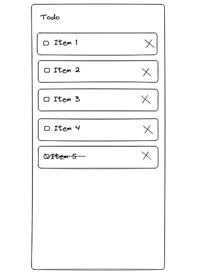
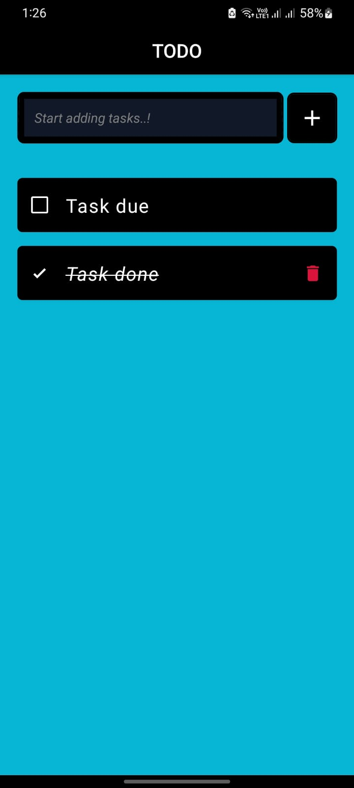

<h1 alight="center"></h1>

  <h1 align="center"> ✅ Todo App (react-native-expo) ✅</h1>
          <StatusBar style="auto" />
  <h3 align="center">Get Your Tasks Done With Simple Todo App</h3>
    

           
      
      
      
  

---

## 📍 Table of Contents

- [🤖 Overview](#-overview)
- [🗺 Sketch](#-sketch)
- [🔮Features](#features)

---

## 🤖 Overview

<ul>
<li>Add Tasks</li>
<li>Toggle Tasks done</li>
<li>Delete Tasks</li>
</ul>
  <a href="#top"><b>🔝 Return </b></a>

---

## 🗺 Sketch & Preview

    
    

---
